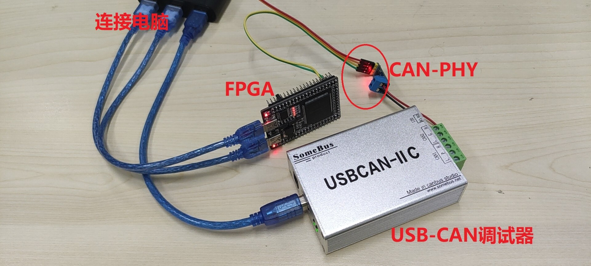

-9A90FD.svg)   

[English](#en) | [中文](#cn)

　

<span id="en">FPGA-liteCAN</span>
===========================

**FPGA** based lightweight **CAN bus controller**.

# Introducion

**CAN bus**, as the most commonly used communication bus in the industrial and automotive fields, has the advantages of simple topology, high reliability, and long transmission distance. The **non-destructive arbitration** mechanism of **CAN bus** relies on the **frame ID**. **CAN2.0A** and **CAN2.0B** respectively specify **11bit-ID (short ID)** for **standard frame** and **29bit-ID (long ID)** for **extended frame**. In addition, there is a data request mechanism called **remote frame**. For more knowledge about CAN bus, please refer to [this article](https://zhuanlan.zhihu.com/p/32262127).

This repository implements a lightweight but complete **FPGA-based CAN controller**, the features are as follows:

* **Platform Independent**: pure Verilog design and can run on various FPGAs such as Altera and Xilinx.
* **Local ID** can be fixed to any **short ID**.
* **Send** : Only supports sending frames with data length of **4Byte** with **local ID**.
* **Receive** : Support to receive frames with **short ID** or **long ID**, the data length of the received frame is not limited (that is, **0~8Byte** is supported).
* **Receive frame ID filtering** : It will only receive data frames that match the filters, their are a short ID filter and a long ID filter independently.
* **Automatic respond to remote frame** : When the received **remote frame** matches the **local ID**, it will automatically send the next data in the send buffer. If the send buffer is empty, the data sent last time will be sent repeatedly.

　

# Design Code

The [RTL](./RTL) folder contains 3 design source files, and the functions of each file are as follows. You only need to include these 3 files into the project, and call the top-level module **can_top.v** to develop your CAN communication applications.

| File Name               | Function                                                     | Note                              |
| :---------------------- | :----------------------------------------------------------- | :-------------------------------- |
| **can_top.v**          | top module of CAN controller.                                |                                   |
| **can_level_packet.v** | Frame-level controller, responsible for parsing or generating frames, and implementing non-destructive arbitration. | called by **can_top.v**          |
| **can_level_bit.v**    | Bit-level controller, responsible for sending and receiving bits, with falling edge alignment mechanism against frequency offset. | called by **can_level_packet.v** |

　

# RTL Simulation

Simulation related files are in the SIM folder, where:

- **tb_can_top.v** is the testbench for **can_top.v**
- **tb_can_top_run_iverilog.bat** is the command script for iverilog simuation

tb_can_top.v describes a scenario where 4 CAN bus devices communicate with each other. Each CAN device is an instantiation of a can_top.v, **Figure1** shows the detailed parameters of each device, the relationship between each device can be drawn as In the figure on the left, the arrows represent the receiving relationship between them. In addition, the driving clock of each CAN device is not strictly 50MHz, but has a different ±1% offset, which is to simulate whether the "auto-alignment" mechanism of the CAN controller can work against a worse practical situation.

|                               |
| :----------------------------------------------------------: |
| **Figure1** : parameters of 4 CAN devices in this simuation. |

Before using iverilog for simulation, you need to install iverilog , see: [iverilog_usage](https://github.com/WangXuan95/WangXuan95/blob/main/iverilog_usage/iverilog_usage.md)

Then double-click tb_can_top_run_iverilog.bat to run the simulation. After the simulation runs, you can open the generated dump.vcd file to view the waveform.

　

# Module Manual

This section introduces how to use **can_top.v** . Its interface is shown in the table below.

| signal   | Direction | Width | Function        | Introduction                                                 |
| :------- | :-------: | :---: | :-------------- | :----------------------------------------------------------- |
| rstn     |    in     |   1   | low-level reset | set rstn=0 before starting to work, then set rstn=1.         |
| clk      |    in     |   1   | driving clock   | The frequency needs to be >10 times of CAN baud rate.        |
| can_rx   |    in     |   1   | CAN-PHY RX      | connected to the CAN-PHY chip (such as TJA1050).             |
| can_tx   |    out    |   1   | CAN-PHY TX      | connected to the CAN-PHY chip (such as TJA1050).             |
| tx_valid |    in     |   1   | send valid      | send data valid.                                             |
| tx_ready |    out    |   1   | send ready      | ready to accept a send data.                                 |
| tx_data  |    in     |  32   | send data       | send data.                                                   |
| rx_valid |    out    |   1   | recv valid      | receive data valid.                                          |
| rx_last  |    out    |   1   | recv last       | rx_last=1 means the rx_data is the last byte of a frame.     |
| rx_data  |    out    |   8   | recv data       | receive data.                                                |
| rx_id    |    out    |  29   | recv ID         | rx_id[28:0] is the long ID, rx_id[10:0] is the short ID.     |
| rx_ide   |    out    |   1   | recv ID type    | rx_ide=1 indicates a long ID, rx_ide=0 indicates a short ID. |

## Connect to CAN bus

`can_rx` and `can_tx` signal of **can_top.v** need to be constraint to FPGA pins and connected to the CAN-PHY chip (such as TJA1050), as shown in **Figure 2**.

|                       |
| :--------------------------------------------------: |
| **Figure2** : connect to CAN bus via a CAN-PHY chip. |

> Note: Although the pins of the FPGA (`can_rx`, `can_tx`) can be 3.3V, the power supply of the CAN-PHY must be 5V, otherwise the driving force for the CAN bus is not enough. In addition, CAN-PHY should share the ground with FPGA.

## User send interface

`tx_valid`, `tx_ready`, `tx_data` of **can_top.v** constitute the streaming input interface, they all align with the rising edge of `clk`, and are used to write a data to the send buffer. As long as the send buffer is not empty and the CAN bus is not busy, the CAN controller will send the data in the send buffer to the CAN bus.

`tx_valid` and `tx_ready` are a pair of handshake signals. The waveform is as shown in the figure below. Only when both `tx_valid` and `tx_ready` are 1, `tx_data` is written to the send buffer. `tx_ready=0` means that the send buffer is full, even if `tx_valid=1`, the send buffer cannot be written. However, when the transmission frequency is not high enough to occupy the CAN bus, the buffer will never full, that is `tx_ready=0` can be ignored.

Take the following figure as an example, the 3 data D0, D1, and D2 are written into the cache. After D0 is written, the send buffer goes full, resulting in `tx_ready=0`, and D1 is not successfully written in the next 3 cycles, but in the 4th clock cycles `tx_ready` becomes 1 and D1 is written. After the sender actively idles for 2 clock cycles, D3 is also written.

Each data is 4Byte (32bit), as long as the FIFO is not empty, the CAN controller will automatically send one frame at a time, one data per frame, and the frame data length is 4Byte.

              _    __    __    __    __    __    __    __    __    __    __    __
     clk       \__/  \__/  \__/  \__/  \__/  \__/  \__/  \__/  \__/  \__/  \__/  \
                          _____________________________             _____
    tx_valid  ___________/                             \___________/     \________
              _________________                   ________________________________
    tx_ready                   \_________________/
                          _____ _______________________             _____
    tx_data   XXXXXXXXXXXX__D0_X___________D1__________XXXXXXXXXXXXX__D3_XXXXXXXXX

## User receive interface

`rx_valid`, `rx_last`, `rx_data`, `rx_id`, `rx_ide` of **can_top.v** form the receive interface, they all align with the rising edge of `clk`.

When a **data frame** matching [ID filter](#Configure ID filter) is received on the CAN bus, the data bytes of this frame will be sent out one by one. Assume that the length of the data frame is n bytes, then `rx_valid` will continuously generate n cycles of high level, meanwhile, `rx_data` will generate a received data byte for each clock cycle, and at the last cycle it will make ` rx_last=1`, indicating the end of a frame. During this whole process, the ID of the frame appears on `rx_id` (if it is a short ID, only the lower 11 bits are valid), meanwhile, `rx_ide` indicates whether the frame is a long ID or a short ID.

An example waveform of the receive interface is as follows. In this example, the module has successively received a short ID data frame with data length = 4, and a long ID data frame with data length = 2.

                 __    __    __    __    __    __    __    __    __    __    __
     clk      __/  \__/  \__/  \__/  \__/  \__/  \__/  \__/  \__/  \__/  \__/  \_
                        _______________________             ___________
    rx_valid  _________/                       \___________/           \_________
                                          _____                   _____
    rx_last   ___________________________/     \_________________/     \_________
                        _____ _____ _____ _____             _____ _____
    rx_data   XXXXXXXXXX__0__X__1__X__2__X__3__XXXXXXXXXXXXX__0__X__1__XXXXXXXXXX
                        _______________________             ___________
    rx_id     XXXXXXXXXX__________ID1__________XXXXXXXXXXXXX____ID2____XXXXXXXXXX
                                                            _____________________
    rx_ide    _____________________________________________/

Unlike the user send interface, the user receive interface has no handshake mechanism. You must capture `rx_data` when `rx_valid=1` or you will lose it.

## Parameter: Local ID

**can_top.v** has a **11bit** parameter called `LOCAL_ID`, which determines the ID of the frame sent by the module. In addition, when **can_top** receives a **remote frame** with the ID that matches `LOCAL_ID`, it will respond (ACK) and automatically reply a **data frame** (if the sending buffer is empty, it will automatically reply to the last sent data).

## Parameter: ID filter

The `RX_ID_SHORT_FILTER` and `RX_ID_SHORT_MASK` parameters of **can_top.v** are used to configure the **short ID filter**. Assume that the short ID of the received **data frame** is `rxid` , and the matching expression is:

    rxid & RX_ID_SHORT_MASK == RX_ID_SHORT_FILTER & RX_ID_SHORT_MASK

The above expressions satisfy the syntax of Verilog or C language. When the expression is true, `rxid` matches the filter, so that the **data frame** can be responded (ACK) by the module and its data will be forwarded to the **user receive interface**. When the expression is false, the `rxid` does not match the filter, then the **data frame** will not only not be acknowledged (ACK), and will not be forwarded to the **user receive interface**.

Similarly, the `RX_ID_LONG_FILTER` and `RX_ID_LONG_MASK` parameters are used to configure the **long ID filter**. Assume that the long ID of the received **data frame** be `rxid` , and the matching expression is:

    rxid & RX_ID_LONG_MASK == RX_ID_LONG_FILTER & RX_ID_LONG_MASK

The **MASK** parameter can be called a **bit-wise wildcard**, bits with mask=1 must match **FILTER**, bits with mask=0 we don’t care, it can match either 1 or 0 .

For example, if you want to receive 0x122, 0x123, 0x1a2, 0x1a3 these 4 **short ID**, you can configure it as:

    RX_ID_SHORT_FILTER = 11'h122,
    RX_ID_SHORT_MASK   = 11'h17e

## Timing Parameter

The three timing parameters `default_c_PTS`, `default_c_PBS1`, `default_c_PBS2` of **can_top.v** determine the default length of the 3 time segments (PTS segment, PBS1 segment, PBS2 segment) of a bit on the CAN bus, For the meaning of these three paragraphs, see [this article](https://zhuanlan.zhihu.com/p/32262127). In general, the division factor is calculated as follows:

    division = default_c_PTS + default_c_PBS1 + default_c_PBS2 + 1

The baud rate calculation method of the CAN bus is:

    CAN_baud = clk_freq / division

For example, in the case of clk=**50MHz**, the following parameter combinations can be used to configure various common CAN baud rates.


| division | CAN baud | default\_c\_PTS | default\_c\_PBS1 | default\_c\_PBS2 |
| :------: | :------: | :-------------: | :--------------: | :--------------: |
|    50    |   1MHz   |     16'd34      |      16'd5       |      16'd10      |
|   100    |  500kHz  |     16'd69      |      16'd10      |      16'd20      |
|   500    |  100kHz  |     16'd349     |      16'd50      |     16'd100      |
|   5000   |  10kHz   |    16'd3499     |     16'd500      |     16'd1000     |
|  10000   |   5kHz   |    16'd6999     |     16'd1000     |     16'd2000     |

　

# FPGA Demo Project

**fpga_top.v** in [FPGA](./FPGA) folder is an example of calling **can_top.v** to achieve simple CAN communication. To run the demo, create an FPGA project and include the following source files:

- fpga_top.v and uart_tx.v in the [FPGA](./FPGA) folder.
- can_top.v , can_level_packet.v , can_level_bit.v in the [RTL](./RTL) folder.

fpga_top.v is the top module of the project, and its pins are connected as follows:

```verilog
module fpga_top (
    // clock, Connect to the oscillator on the FPGA board, the frequency must be 50MHz.
    input  wire           CLK50M,
    // UART (TX only), connect to the serial port of the computer (for example, through the USB to UART module), not necessary.
    output wire           UART_TX,
    // CAN bus, connect to CAN-PHY chip.
    input  wire           CAN_RX,
    output wire           CAN_TX
);
```

The behavior of this demo is:

- The local (aka the FPGA's) ID is configured as 0x456, so all outgoing data frames have an ID of 0x456.
- The ID filter is configured to only receive data frames with **short ID**=**0x123** or **long ID**=**0x12345678**.
- Send an incremental data to CAN bus every second.
- The data frame received on the CAN bus (which match the ID filter) will be send to the computer via UART.

> Note: In this demo, the baud rate of CAN is 1MHz; the configuration of UART is 115200,8,n,1

|      |
| :--------------------------------: |
| **Figure3** : Hardware connection. |

When I tested this example, I connected the CAN bus to a **USB-CAN debugger**, as shown in **Figure3**. Then compile the project and program to FPGA, open the **USB-CAN debugger** supporting software, you can see the following phenomenon:

* The software will receive a frame from the FPGA every second, the data length is 4 (DLC=4), and the value is incremented. Such as the unboxed part in **Figure4**.
* Send a data frame with **short ID**=**0x123** or **long ID**=**0x12345678** in the software, it will display "send successfully", as shown in the blue boxes in **Figure4**, indicating that the frame was responded by the FPGA. Simutinously, if you connect the UART to the serial port of the computer, you can see the printed data in serial port software such as "Serial Assistant", "HyperTerminal", "putty" or "minicom".
* Send a remote frame with **short ID**=**0x456** in the software, then the FPGA will immediately respond with a data frame, as shown in the red box in **Figure4**.


|                                  |
| :----------------------------------------------------------: |
| **Figure4**: Phenomenon observed on the software of the USB-CAN debugger. |


　

　

　

　


<span id="cn">FPGA-liteCAN</span>
===========================

基于 **FPGA** 的轻量级**CAN总线控制器**

# 简介

**CAN总线**作为工业和汽车领域最常用的通信总线，具有拓扑结构简洁、可靠性高、传输距离长等优点。**CAN总线**的**非破坏性仲裁**机制依赖于**帧ID**，**CAN2.0A**和**CAN2.0B**分别规定了**11bit-ID(短ID)** 的**标准帧**和**29bit-ID(长ID)** 的**扩展帧**，另外，还有**远程帧**这种数据请求机制。关于CAN总线的更多知识可以参考[这个科普文章](https://zhuanlan.zhihu.com/p/32262127)。

本库实现了一个**轻量化**但**完备**的**FPGA CAN总线控制器**，特点如下：

* **平台无关** ：纯 Verilog 编写，可以在 Altera 和 Xilinx 等各种 FPGA 上运行。
* **本地ID**可固定配置为任意**短ID**。
* **发送** : 仅支持以**本地ID**发送数据长度为**4Byte**的帧。
* **接收** : 支持接收**短ID**或**长ID**的帧，接收帧的数据长度没有限制 (即支持 **0~8Byte** ) 。
* **接收帧过滤** : 可针对**短ID**和**长ID**独立设置过滤器，只接收和过滤器匹配的数据帧。
* **自动响应远程帧** : 当收到的**远程帧**与**本地ID**匹配时，自动将发送缓存中的下一个数据发送出去。若缓存为空，则重复发送上次发过的数据。

　

# 设计文件

RTL 文件夹包含3个设计代码文件，各文件功能如下表。你只需将这3个文件包含进工程，就可以调用顶层模块**can_top.v**进行CAN通信业务的开发。

| 文件名 | 功能 | 备注 |
| :-- |   :-- |   :-- |
| **can_top.v** | CAN控制器的顶层 |                               |
| **can_level_packet.v** | 帧级控制器，负责解析或生成帧，并实现非破坏性仲裁 | 被**can_top.v**调用 |
| **can_level_bit.v** | 位级控制器，负责收发bit，具有抗频率偏移的下降沿对齐机制 | 被**can_level_packet.v**调用 |

　

# 仿真文件

仿真相关的文件都在 SIM 文件夹中，其中：

- tb_can_top.v 是针对 can_top.v 的 testbench 。
- tb_can_top_run_iverilog.bat 包含了运行 iverilog 仿真的命令。

tb_can_top.v 描述了4个CAN总线设备互相进行通信的场景，每个设备都是一个 can_top 的例化，**图1**是每个设备的详细属性，各个设备互相接收的关系可以画成左侧的图，箭头代表了各个设备之间的接收关系。另外，每个CAN设备的驱动时钟并不严格是50MHz，而是有不同的±1%的偏移，这是为了模拟更糟糕的实际情况下，CAN控制器的“自动对齐”机制能否奏效。

|        |
| :-----------------------------------: |
| **图1**：仿真中的4个CAN设备的详细参数 |

使用 iverilog 进行仿真前，需要安装 iverilog ，见：[iverilog_usage](https://github.com/WangXuan95/WangXuan95/blob/main/iverilog_usage/iverilog_usage.md)

然后双击 tb_can_top_run_iverilog.bat 运行仿真。仿真运行完后，可以打开生成的 dump.vcd 文件查看波形。

　

# 顶层模块说明

本节介绍如何使用 **can_top.v** ，它的接口如下表。

| 信号名 | 方向 | 宽度 | 功能 | 备注 |
| :-- |   :--: |   :--: |    :-- |    :-- |
| rstn | 输入 | 1 | 低电平复位 | 在开始工作前需要拉低复位一下 |
| clk | 输入 | 1 | 驱动时钟 | 频率需要是CAN总线波特率的10倍以上，内部分频产生波特率 |
| can_rx | 输入 | 1 | CAN-PHY RX | 应通过FPGA的普通IO引出，接CAN-PHY芯片 (例如TJA1050) |
| can_tx | 输出 | 1 | CAN-PHY TX | 应通过FPGA的普通IO引出，接CAN-PHY芯片 (例如TJA1050) |
| tx_valid | 输入 | 1 | 发送有效 | 当=1时，若发送缓存未满(即tx_ready=1)，则tx_data被送入发送缓存 |
| tx_ready | 输出 | 1 | 发送就绪 | 当=1时，说明发送缓存未满。与 tx_valid 构成一对握手信号 |
| tx_data | 输入 | 32 | 发送数据 | 当tx_valid=1时需要同步给出待发送数据 tx_data |
| rx_valid | 输出 | 1 | 接收有效 | 当=1时，rx_data上产生1字节的有效接收数据 |
| rx_last | 输出 | 1 | 接收最后字节指示 | 当=1时，说明当前的rx_data是一个帧的最后一个数据字节 |
| rx_data | 输出 | 8 | 接收数据 | 当rx_valid=1时，rx_data上产生1字节的有效接收数据 |
| rx_id | 输出 | 29 | 接收ID | 指示当前接收帧的ID，若为短ID则低11bit有效 |
| rx_ide | 输出 | 1 | 接收ID类型 | =1 说明当前接收帧是长ID，否则为短ID |

## 接入CAN总线

**can_top.v**的 `can_rx` 和 `can_tx` 接口需要引出到FPGA引脚上，并接CAN-PHY芯片（比如TJA1050），如**图2**。

|  |
| :--: |
| **图2**：接入CAN总线的方式 |

> 注：这里注意一个坑，虽然FPGA的引脚(can_rx,can_tx)可以是3.3V电平的，但CAN-PHY的电源必须是5V的，否则对CAN总线的驱动力不够。另外，CAN-PHY要和FPGA共地。

## 用户发送接口

**can_top.v** 的 `tx_valid`, `tx_ready`, `tx_data` 构成了流式输入接口，它们都与 `clk` 的上升沿对齐，用于向发送缓存中写入一个数据。只要发送缓冲区不为空，其中的数据会逐个被CAN控制器发送到CAN总线上。

`tx_valid` 和 `tx_ready` 是一对握手信号，波形如下图，只有当 `tx_valid` 和 `tx_ready` 都为1时，`tx_data` 才被写入缓存。`tx_ready=0` 说明缓存已满，此时即使 `tx_valid=1` ，也无法写入缓存。不过，当发送频率不高而不至于让 CAN 总线达到饱和时，可以不用考虑缓存满（即`tx_ready=0`）的情况。

下图中，D0,D1,D2这3个数据被写入缓存，D0写入后，缓存已满，导致`tx_ready=0`，之后的3个周期D1都没有成功写入，但在第4个时钟周期`tx_ready`变成1，D1被写入。之后发送方主动空闲2个时钟周期后，D3也被写入。

每个数据都是4Byte(32bit)的，只要FIFO不为空，该CAN控制器就自动地每次发送一个帧，每帧一个数据，帧数据长度为4Byte。

              _    __    __    __    __    __    __    __    __    __    __    __
     clk       \__/  \__/  \__/  \__/  \__/  \__/  \__/  \__/  \__/  \__/  \__/  \
                          _____________________________             _____
    tx_valid  ___________/                             \___________/     \________
              _________________                   ________________________________
    tx_ready                   \_________________/
                          _____ _______________________             _____
    tx_data   XXXXXXXXXXXX__D0_X___________D1__________XXXXXXXXXXXXX__D3_XXXXXXXXX

## 用户接收接口

**can_top.v** 的 `rx_valid`, `rx_last`, `rx_data`, `rx_id`, `rx_ide` 构成了接收接口，它们都与 `clk` 的上升沿对齐。

当CAN总线上收到了一个与[ID过滤器](#配置ID过滤器)匹配的**数据帧**后，会将这一帧的字节逐个发送出来。设数据帧长为n字节，则`rx_valid`上会连续产生n个周期的高电平，同时`rx_data`上每拍时钟会产生一个收到的数据字节，在最后一拍会让`rx_last=1`，指示一帧的结束。在整个过程中，`rx_id`上出现该帧的ID（若为短ID，则只有低11bit有效），同时，`rx_ide`指示该帧为长ID还是短ID。

接收接口的波形图举例如下，该例中模块先后收到了一个短ID的，数据长度为4的数据帧，和一个长ID的，数据长度为2的数据帧。

                 __    __    __    __    __    __    __    __    __    __    __
     clk      __/  \__/  \__/  \__/  \__/  \__/  \__/  \__/  \__/  \__/  \__/  \_
                        _______________________             ___________
    rx_valid  _________/                       \___________/           \_________
                                          _____                   _____
    rx_last   ___________________________/     \_________________/     \_________
                        _____ _____ _____ _____             _____ _____
    rx_data   XXXXXXXXXX__0__X__1__X__2__X__3__XXXXXXXXXXXXX__0__X__1__XXXXXXXXXX
                        _______________________             ___________
    rx_id     XXXXXXXXXX__________ID1__________XXXXXXXXXXXXX____ID2____XXXXXXXXXX
                                                            _____________________
    rx_ide    _____________________________________________/

与发送接口不同，接收接口无握手机制，只要收到数据就让`rx_valid=1`来发出，不会等待接收方是否能接受。

## 配置本地ID

**can_top.v** 有一个**11bit**的参数(parameter)叫 `LOCAL_ID`，它决定了该模块发送的帧的ID；同时，当**can_top**接收的**远程帧**的ID与`LOCAL_ID`匹配时，就会进行响应(ACK)，并自动回复一个**数据帧**（如果发送缓存为空，则自动重复回复上次发过的数据）。

## 配置ID过滤器

**can_top.v** 的 `RX_ID_SHORT_FILTER` 和 `RX_ID_SHORT_MASK` 参数用来配置**短ID过滤器**。设收到的**数据帧**的ID是 `rxid` (短)，匹配表达式为：

    rxid & RX_ID_SHORT_MASK == RX_ID_SHORT_FILTER & RX_ID_SHORT_MASK

以上表达式满足 Verilog 或 C 语言的语法。表达式为真时，`rxid` 与过滤器匹配，这样的**数据帧**才能被模块响应(ACK)，并将其数据转发到**用户接受接口**上。表达式为假时，`rxid` 与过滤器不匹配，该**数据帧**不仅不会被响应(ACK)，也不会被转发到**用户接受接口**上。

同理，`RX_ID_LONG_FILTER` 和 `RX_ID_LONG_MASK` 参数用来配置**长ID过滤器**。设收到的**数据帧**的ID是 `rxid` (长)，匹配表达式为：

    rxid & RX_ID_LONG_MASK == RX_ID_LONG_FILTER & RX_ID_LONG_MASK

**MASK** 参数可以被称为**通配掩码**，掩码=1的位必须匹配 **FILTER** ，掩码=0的位我们不在乎，既可以匹配1也可以匹配0。

例如你想接收 0x122, 0x123, 0x1a2, 0x1a3 这4种**短ID**，则可配置为：

    RX_ID_SHORT_FILTER = 11'h122,
    RX_ID_SHORT_MASK   = 11'h17e

## 配置时序参数

**can_top.v** 的 `default_c_PTS`, `default_c_PBS1`, `default_c_PBS2` 这3个时序参数决定了CAN总线上的一个位的3个段（PTS段, PBS1段, PBS2段）的默认长度，这3个段的含义详见[这个科普文章](https://zhuanlan.zhihu.com/p/32262127)。总的来说，分频系数计算如下：

    分频系数 = default_c_PTS + default_c_PBS1 + default_c_PBS2 + 1

而CAN总线的波特率计算方法为：

    CAN波特率 = clk频率 / 分频系数

例如，在 clk=**50MHz** 的情况下，可以使用如下参数组合来配置出各种常见的波特率。


| 分频系数 | 波特率 | default_c_PTS | default_c_PBS1 | default_c_PBS2 |
| :--:     | :-:| :-: | :-: | :-: |
|    50 | 1MHz  |  16'd34  |  16'd5  |  16'd10 |
|   100 | 500kHz |  16'd69  |  16'd10 |  16'd20 |
|   500 | 100kHz |  16'd349 |  16'd50 |  16'd100 |
|  5000 | 10kHz | 16'd3499 | 16'd500 |  16'd1000 |
| 10000 | 5kHz  | 16'd6999 | 16'd1000 | 16'd2000 |

　

# 示例程序

FPGA 目录里的 **fpga_top.v** 是一个调用 **can_top.v** 进行简单的 CAN 通信的案例。要运行该案例，请建立 FPGA 工程，并加入以下源文件：

- FPGA 目录里的 fpga_top.v 、 uart_tx.v 。
- RTL 目录里的 can_top.v 、 can_level_packet.v 、 can_level_bit.v 。

fpga_top.v 是项目的顶层，其引脚连接方法如下：

```verilog
module fpga_top (
    // clock ，连接到 FPGA 板上晶振，频率必须为 50MHz 
    input  wire           CLK50M,
    // UART (TX only), 连接到电脑串口（比如通过 USB 转 UART 模块），不方便接 UART 可以不接
    output wire           UART_TX,
    // CAN bus, 连接到 CAN PHY 芯片，然后 CAN PHY 连接到 CAN 总线（如图2）
    input  wire           CAN_RX,
    output wire           CAN_TX
);
```

该案例的行为是：

- 本地 (也就是 FPGA) 的 CAN ID 配置为 0x456 ，因此所有发出的数据帧的 ID 都为 0x456 。
- ID 过滤器配置为只接收 **短ID**=**0x123** 或 **长ID**=**0x12345678** 的数据帧。
- 每一秒向发送缓存中送入一个递增的数据，该数据帧并会被发送到 CAN 总线上。
- 将 CAN 总线上接收到的（也就是符合过滤器配置）的数据帧通过 UART 发送给电脑。

> 注：该案例中，CAN 的波特率为 1MHz ； UART 的格式为 115200,8,n,1 

|  |
| :--: |
| **图3**：硬件连接 |

我在测试该例子时，将 CAN 总线与一台 **USB-CAN调试器** 相连，如**图3**。然后编译工程并下载FPGA，打开**USB-CAN调试器**的配套软件，可以看到如下现象：

* 软件中每秒会收到一个 FPGA 发来的帧，数据长度DLC=4，值递增。如**图4**中没框的部分。
* 在软件中发送**短ID**=**0x123**或**长ID**=**0x12345678**的数据帧，会显示“发送成功”，如**图4**中蓝框的部分，说明该帧被 FPGA 响应了。同时，如果你把FPGA的UART连接到了电脑的串口，则可以在“串口助手”或“HyperTerminal”等软件上看到打印出的数据内容。
* 在软件中发送**短ID**=**0x456**的远程帧，FPGA 会立即响应一个数据帧，如**图4**中红框的部分。


|  |
| :--: |
| **图4**：USB-CAN调试器的配套软件上观察到的现象 |

